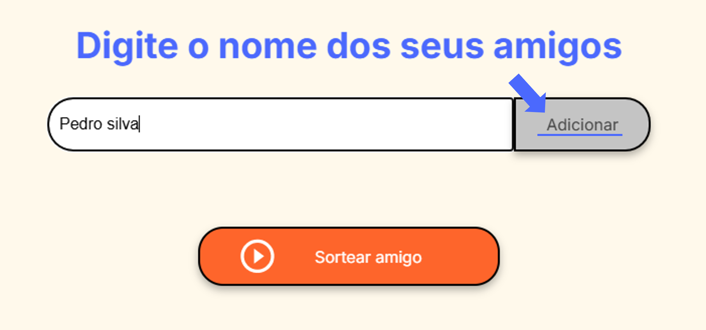
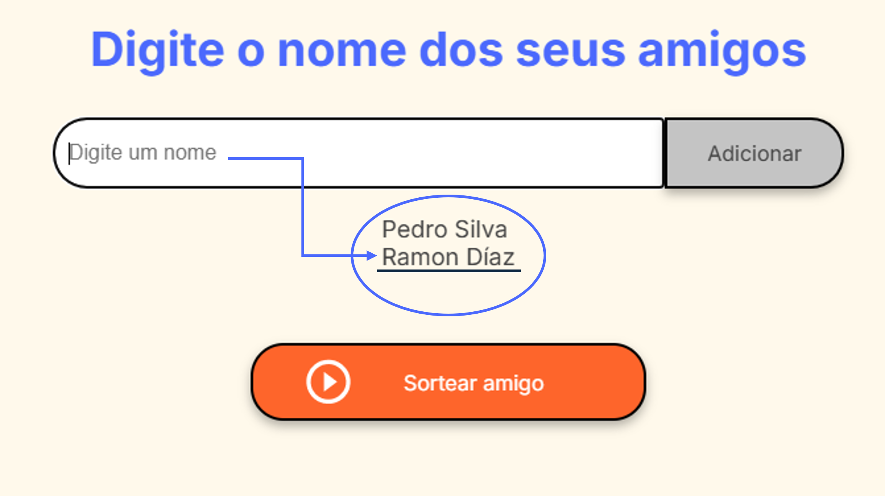
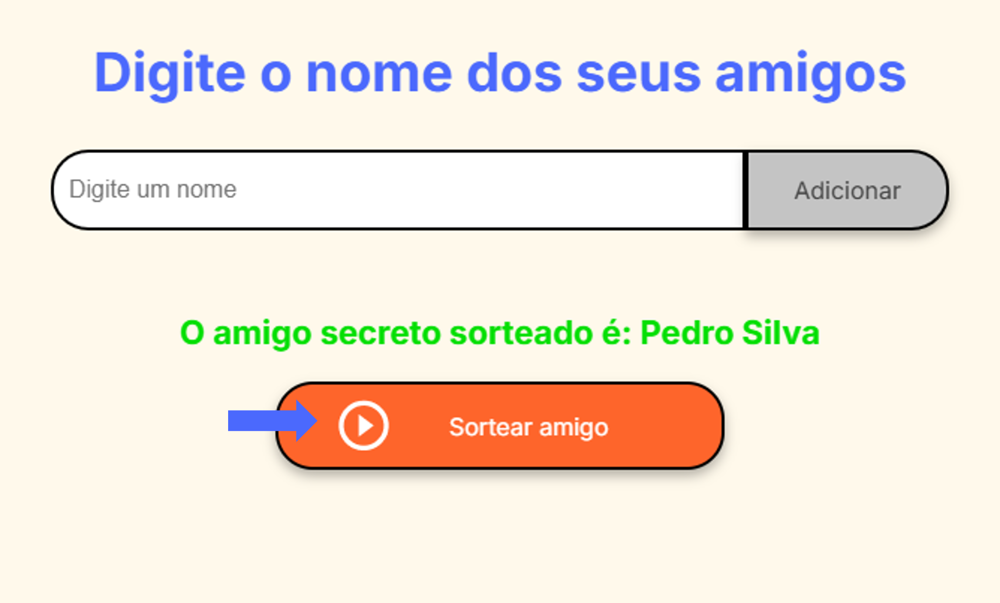

# Amigo Secreto 🎉

Bem-vindo ao projeto **Amigo Secreto**! Proposto do challenge da ONE - (Oracle Next Education) junto a Alura.

Este é um aplicativo web simples para organizar e sortear amigos secretos de forma divertida e interativa.

## 📋 Descrição

O **Amigo Secreto** permite que você adicione nomes de amigos a uma lista e sorteie um amigo secreto de forma aleatória. O aplicativo é estilizado com CSS e utiliza JavaScript para manipulação do DOM e lógica de sorteio.

## 🚀 Funcionalidades

- Adicionar nomes de amigos à lista
- Exibir a lista de amigos adicionados
- Sortear um amigo secreto aleatoriamente
- Interface amigável e responsiva

## 🛠️ Tecnologias Utilizadas

- HTML
- CSS
- JavaScript

## 📸 Imagens

### Adicionar Amigos

Você pode adicionar nomes de amigos à lista. O nome será formatado para que a primeira letra de cada palavra seja maiúscula.

### Exibir Nomes

Os nomes adicionados são exibidos em uma lista na tela.

### Sortear Amigo Secreto

Quando houver pelo menos dois amigos na lista, você pode sortear um amigo secreto.

## Acesse o Projeto

Você pode acessar o projeto através deste [link](https://artiovanni.github.io/challenge-amigo-secreto/).

## Como Usar

1. Digite o nome de um amigo no campo de entrada.
2. Clique no botão "Adicionar Amigo" para adicionar o nome à lista.
3. Os nomes adicionados serão exibidos na lista abaixo do campo de entrada.
4. Quando houver pelo menos dois amigos na lista, clique no botão "Sortear Amigo Secreto" para sortear um amigo.
